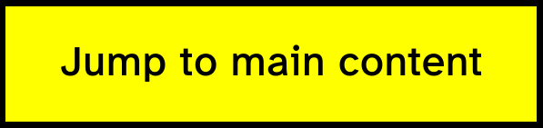
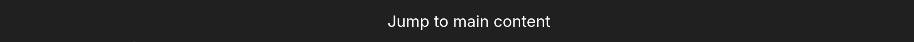
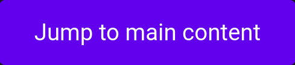

# eleventy-plugin-skiplink

Automatically insert a skiplink on your 11ty-page to improve accessibility for readers who navigate with a keyboard. [What is a skiplink and why you should use one?](https://www.w3.org/WAI/test-evaluate/easy-checks/skip-link/)

## How to use

### Inline CSS

1. Install this plugin with `npm install eleventy-plugin-skiplink --save`
2. In your `.eleventy.js`:

```js
const skipLink = require("eleventy-plugin-skiplink");

module.exports = function (eleventyConfig) {
  eleventyConfig.addPlugin(skiplink, {
    id: "custom-id-to-jump-to",
    text: "some custom text",
    customStyles: {
      base: "position:absolute; left:50%; transform:translateX(-50%); background:#ffff00; color:#000000; font-weight:bold; padding:15px 25px; border:3px solid #000000; border-radius:0; font-size:1.2rem; text-decoration:none; z-index:9999; transition:top 0.3s ease;",
      hidden: "top:-100px;",
      visible: "top:0;outline:3px solid #000000;",
    },
  });
};
```

`base`, `hidden` and `visible` are all inline CSS and optional. If not defined this plugin adds some pre-defined styling.

### Class-based styling

1. Install this plugin with `npm install eleventy-plugin-skiplink --save`
2. In your `.eleventy.js`:

```js
const skipLink = require("eleventy-plugin-skiplink");

module.exports = function (eleventyConfig) {
  eleventyConfig.addPlugin(skipLink, {
    id: "main-content",
    text: "Jump to main content",
    styling: false,
    className: "my-custom-skiplink",
  });
};
```

and in your CSS-file:

```css
.my-custom-skiplink {
  position: absolute;
  left: 50%;
  transform: translateX(-50%);
  background: #ffff00;
  color: #000000;
  font-weight: bold;
  padding: 15px 25px;
  border: 3px solid #000000;
  z-index: 9999;
  transition: top 0.3s ease;
  top: -100px; /* Hidden state */
}

.my-custom-skiplink:focus {
  top: 0; /* Visible state */
  outline: 3px solid #000000;
}
```

## Optional Variables

| Variable                | Description                                                                                         |
| ----------------------- | --------------------------------------------------------------------------------------------------- |
| `id`                    | Defines the id that the skipLink will jump to. Enter with without `#`. `main-content` by default.   |
| `text`                  | Defines the text that the skipLink will display. `Jump to main-content` by default.                 |
| `styling`               | Boolean that defines if the skipLink has any pre-defined styles applied. True by default.           |
| `customStyling`         | Option to define customStyling. Overwrites pre-defined styling. You can see various examples below. |
| `customStyling.base`    | Custom styling for the button itself. Overwrites pre-defined styling.                               |
| `customStyling.hidden`  | Custom styling for the button if its hidden. Overwrites pre-defined styling.                        |
| `customStyling.visible` | Custom styling for the button if its visible. Overwrites pre-defined styling.                       |

## Usage in 11ty

This plugin creates a skipLink where places which is only visible when in focus. Place is as the first element in your header so it will be the first element that gets focused when pressing tab. Use it as a [shortcode](https://www.11ty.dev/docs/shortcodes/):

```njk
 <-- Liquid & Nunjuck
```

and in your HTML define a HTML-element with the id `main-content` or a custom one you provided in the config:

```html
<main id="main-content">
  <h1>Some super cool website made with 11ty</h1>
</main>
```

## Custom styling

By default the rendered component has some styling applied to it. If you want you can turn off any existing styling by setting `styling` in your config to `false`. You can also add custom styling by editing `customStyling` in your config. If you provide any custom styling it will overwrite the default styling, whether it is set to true or false.

### Examples

<details>
<summary>High contrast style</summary>

<br>

```javascript
eleventyConfig.addPlugin(skiplink, {
  text: "some custom text",
  customStyles: {
    base: "position:absolute; left:50%; transform:translateX(-50%); background:#ffff00; color:#000000; font-weight:bold; padding:15px 25px; border:3px solid #000000; border-radius:0; font-size:1.2rem; text-decoration:none; z-index:9999; transition:top 0.3s ease;",
    hidden: "top:-100px;",
    visible: "top:0;outline:3px solid #000000;",
  },
});
```

</details>

<details>
<summary>Minimal modern style</summary>

<br>

```javascript
eleventyConfig.addPlugin(skiplink, {
  customStyles: {
    base: "position:fixed; left:0; width:100%; background:rgba(33, 33, 33, 0.95); color:#ffffff; text-align:center; padding:12px; font-family:system-ui, sans-serif; text-decoration:none; z-index:1000; transition:top 0.2s;",
    hidden: "top:-100%;",
    visible: "top:0; box-shadow:0 2px 10px rgba(0, 0, 0, 0.3);",
  },
});
```

</details>

<details>
<summary>Colorful accessible style</summary>

<br>

```javascript
eleventyConfig.addPlugin(skiplink, {
  customStyles: {
    base: "position:absolute; left:20px; background:#4a36ec; color:#ffffff; padding:10px 20px; border-radius:0 0 8px 8px; font-weight:bold; box-shadow:0 0 10px rgba(0, 0, 0, 0.2); text-decoration:none; z-index:100; transition:top 0.3s cubic-bezier(0.175, 0.885, 0.32, 1.275);",
    hidden: "top:-50px;",
    visible: "top:0; outline:2px solid #ffffff; outline-offset:2px;",
  },
});
```

</details>

<details>
<summary>Material design inspired</summary>

<br>

```javascript
eleventyConfig.addPlugin(skiplink, {
  customStyles: {
    base: "position:absolute; left:50%; transform:translateX(-50%); background:#6200ee; color:white; padding:12px 24px; border-radius:4px; text-decoration:none; z-index:1000; box-shadow:0 2px 5px rgba(0,0,0,0); transition:top 0.2s ease, box-shadow 0.2s ease;",
    hidden: "top:-60px;",
    visible: "top:20px; box-shadow:0 8px 17px rgba(0,0,0,0.2); outline:none;",
  },
});
```

</details>
